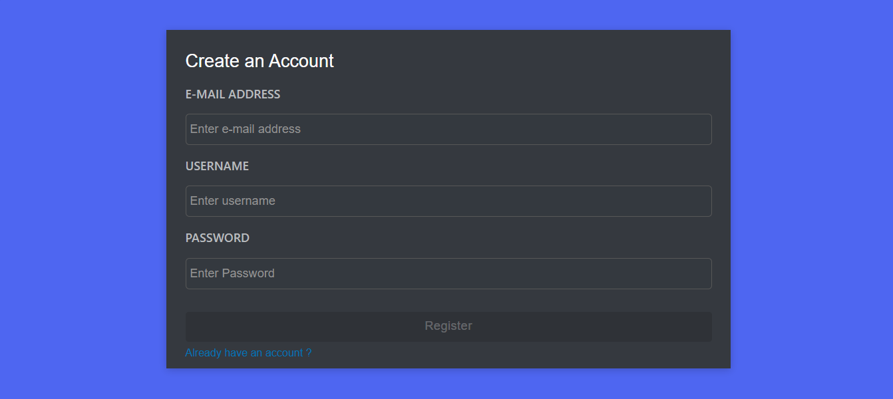
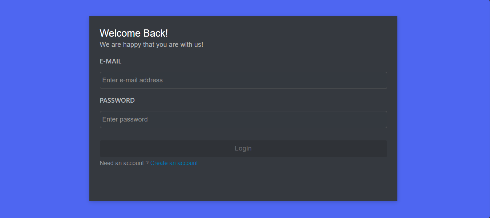
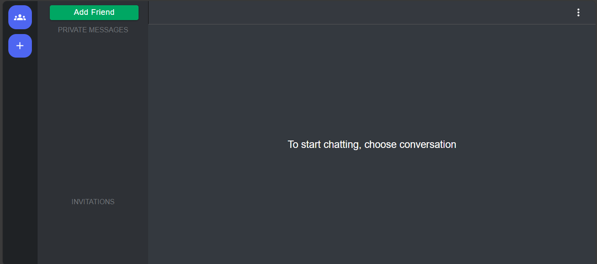
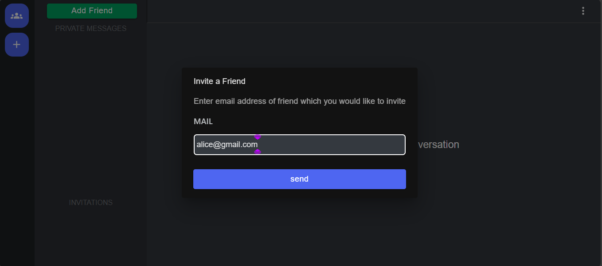
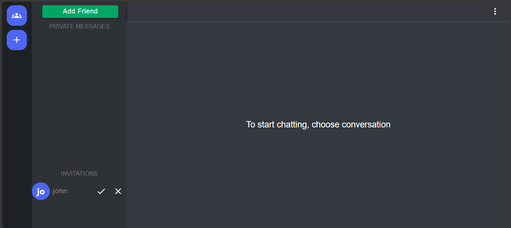
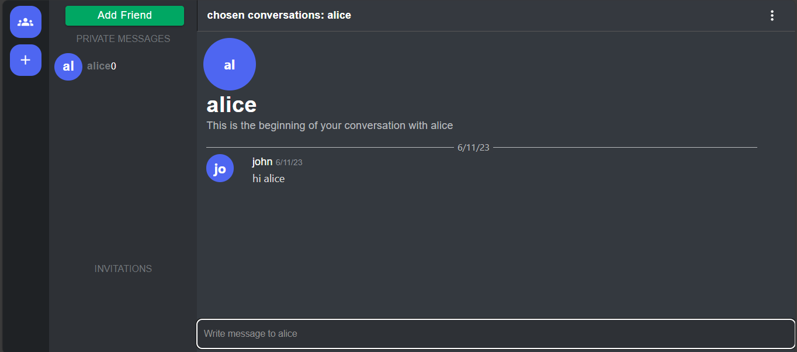

# Discord-Clone

## Overview
Discord like chat application using React js and Spring Websockets ( Stomp over Websockets ) 

## Technologies Used
Built with Java and Spring Boot in backend and html, css and React js in frontend and MongoDB as database 

## Features
- User authentication
- Chat via direct messages 
- Online / Offline indicator when users join / leave
- notification on new incoming message from friend
- WebSocket security with Spring Security

## Screenshot

